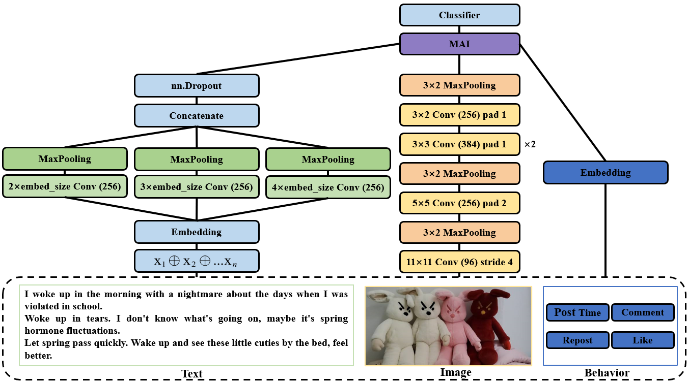
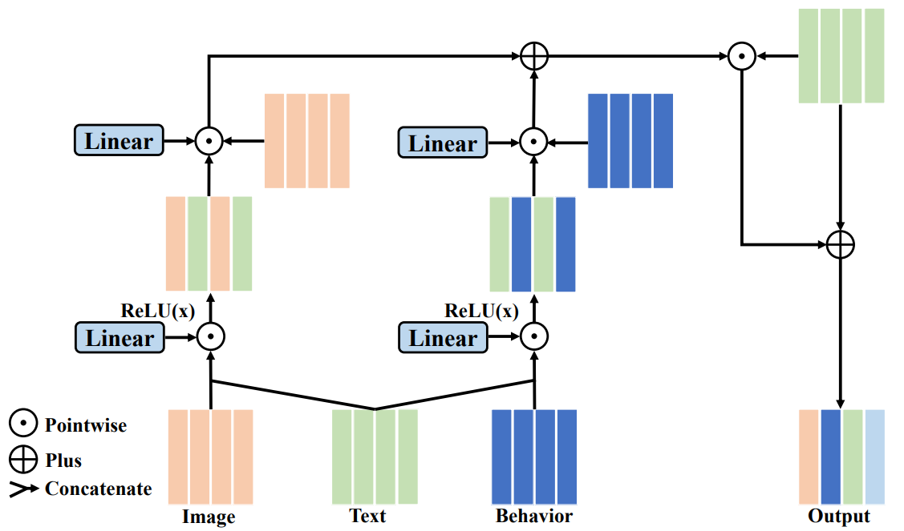
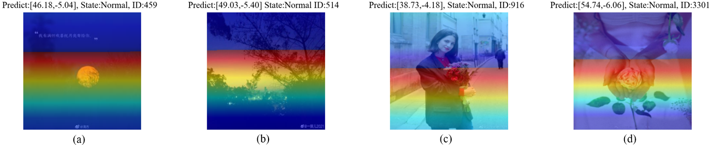
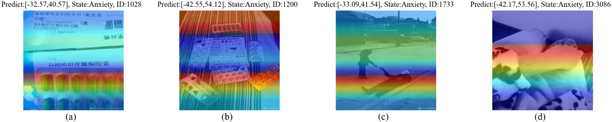

# MADNet
## "Detection of potential anxiety in social media based on multimodal fusion with deep learning methods" has received by BIBM-2023 as regular paper.
This is the Pytorch implementation of MADNet mentioned by paper.

## 1.MADNet Architecture
Three modalities input : text, image, behavior


## 2.MAI Fusion Method
Fusing textual features and non-textual features


## 3.For Visualization

We use Eigen-grad-cam method to plot the attention of model on image.

Redder the area, more attention the model pay.

For Normal label group



For Anxiety label group



## 4.Cite
Please read our origin paper to gain more details. If you have any question, feel free to contact with us!
```
@inproceedings{lai2023detection,
  title={Detection of potential anxiety in social media based on multimodal fusion with deep learning methods},
  author={Lai, Shuzhong and Li, Zepeng},
  booktitle={2023 IEEE International Conference on Bioinformatics and Biomedicine (BIBM)},
  pages={560--566},
  year={2023},
  organization={IEEE}
}
```


